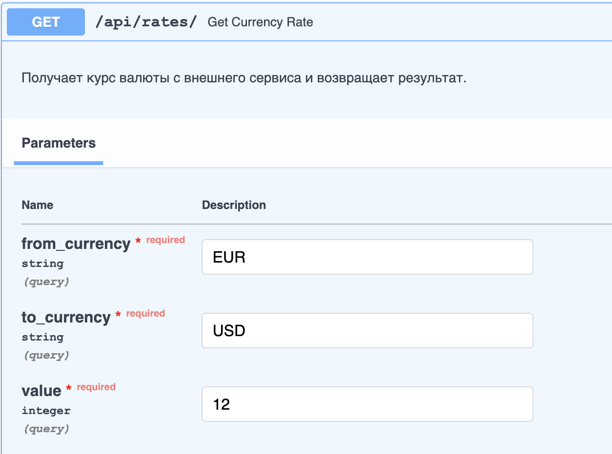
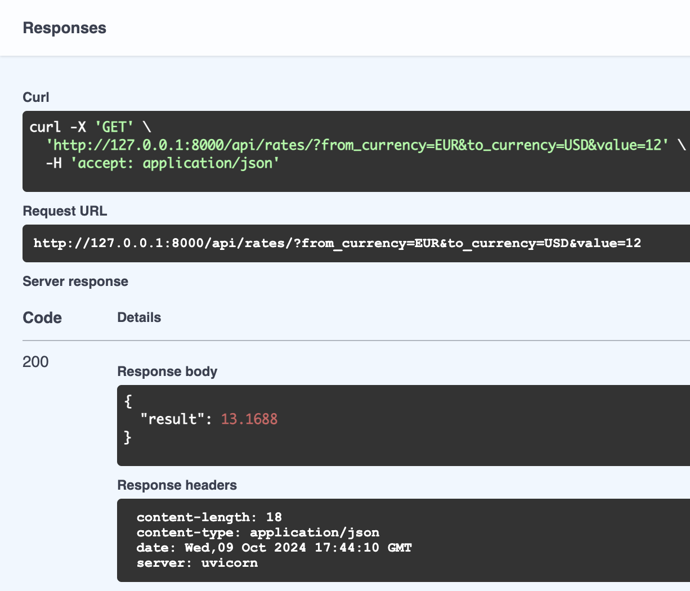

## Тестовое задание для Айти Гуру

Чтобы запустить сервис, создайте образ и докер-контейнер
```
docker build -t currency-converter . && docker run -p 8000:8000 currency-converter
```

Интерактивная документация доступна по этому адресу
```
http://127.0.0.1:8000/docs
```

### Пример использования

Parameters:
from_currency: EUR,
to_currency: USD,
value: 12



Request URL
http://127.0.0.1:8000/api/rates/?from_currency=EUR&to_currency=USD&value=12
	
Response


_Перечень валют можно посмотреть, например, здесь:_
https://www.iban.ru/currency-codes

